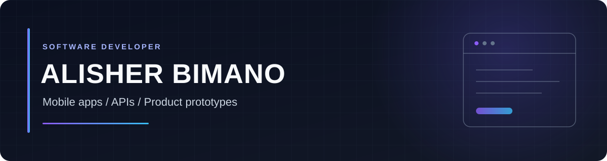

  

I build product prototypes across mobile, backend, and on-chain workflows. My public work ranges from a Flutter legal-assistance app with AI integrations to a Solana Devnet invoicing prototype.

## Selected projects

### 01 / LegalHelp KZ

**Legal-assistance mobile app for Kazakhstan.** The Flutter code brings together legal Q&A, document scanning and analysis, lawyer discovery, and account flows. Firebase Auth, Firestore, Cloud Functions, Riverpod, Gemini, and ML Kit connect the interface to data and AI features.

[Explore the app](https://github.com/ex1zide/123) · [Earlier iteration](https://github.com/ex1zide/ailawyer)

### 02 / InvoiceFlow

**Invoice and payment prototype on Solana Devnet.** An Anchor program stores invoices in program-derived accounts and transfers demo tokens when a customer pays; a Vite client reads the resulting on-chain state. The repository also includes a Rust CLI and transaction evidence. This is a Devnet prototype, not a real-money payment service.

[Explore the code](https://github.com/ex1zide/invoiceflow-solana) · [See the interface](https://github.com/ex1zide/invoiceflow-solana/blob/main/assets/invoiceflow-invoices.png)

## Engineering practice

- **[FastAPI Notes API](https://github.com/ex1zide/FastAPI/tree/main/20_%D0%91%D0%B8%D0%BC%D0%B0%D0%BD%D0%BE%D0%B2_%D0%90%D0%BB%D0%B8%D1%88%D0%B5%D1%80)** — backend coursework with authentication, notes, WebSockets, Redis rate limiting, and metrics.
- **[Next.js + FastAPI microblog](https://github.com/ex1zide/10-project/tree/master/project-10-microblog-app)** — full-stack coursework exploring posts, likes, user pages, and SQLModel persistence.

## Stack visible in the code

| Area | Tools |
| --- | --- |
| Mobile & web | Flutter · Dart · React · Next.js · TypeScript |
| APIs & data | Python · FastAPI · Firebase Cloud Functions · Firestore · SQLModel · Redis |
| AI & on-chain | Gemini API · ML Kit OCR · Rust · Anchor · Solana |

  <a href="https://github.com/ex1zide">GitHub</a>

